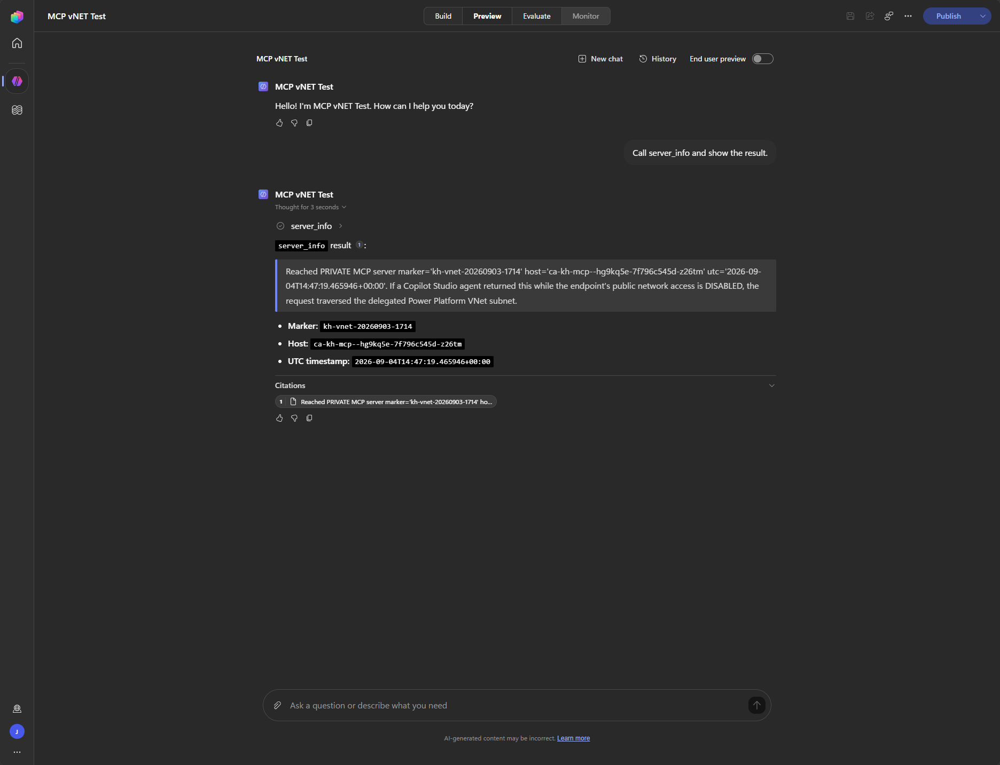
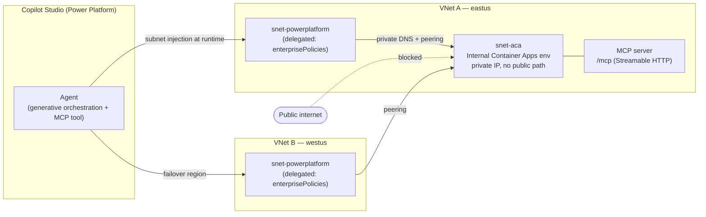

# Private MCP over Power Platform VNet — Copilot Studio proof rig

**Can a Microsoft Copilot Studio agent call a *private* MCP server — one with no public network path — over an Azure Virtual Network?**

**Yes.** This repo is a minimal, reproducible test rig that proves it end‑to‑end: a tiny MCP server hosted with **no public path**, reached by a Copilot Studio agent whose environment is injected into a delegated **Power Platform VNet** subnet. If the agent gets a response, the traffic *had* to traverse the private subnet — so reachability itself is the proof.



> Verified run: the agent returned the server's deploy marker at `14:47:19Z` while the **same** endpoint was unresolvable/unreachable from the public internet at `14:48:00Z`. Same endpoint, same minute — the only path that exists is the delegated Power Platform subnet.

---

## Why this matters

Copilot Studio's *documented* private‑VNet scenarios are the **HTTP Request node**, **Application Insights**, and **VNet‑supported connectors** — native **MCP tools are not on that list**. But MCP tools are implemented as custom connectors (which *are* VNet‑supported) and MCP is just Streamable HTTP, so the native path *should* work. This rig removes the doubt with an empirical, binary result — including that **design‑time tool enumeration** also routes over the VNet, not just runtime calls.

## Architecture



- **Enterprise policy** links the two delegated subnets to the Power Platform environment (subnet injection).
- The MCP server runs in an **internal‑only Azure Container Apps environment** — private IP, managed TLS, **no public endpoint**.
- A **private DNS zone** (linked to both VNets) resolves the app FQDN to the private IP; **VNet peering** makes it reachable from either region's delegated subnet.

> **Why Container Apps and not App Service?** App Service private‑endpoint hosting needs a Basic+ plan, which fails on subscriptions capped at 0 App Service compute (`Total VMs: 0`). An **internal ACA environment** gives an equivalent private‑only HTTPS endpoint with a managed cert and uses ACA quota instead. If you have App Service quota, an App Service + private endpoint variant works too (see `docs/`).

## Repo layout

```
server/    Minimal Streamable-HTTP MCP server (echo + server_info), Dockerfile, local smoke test
infra/     Numbered PowerShell + az CLI scripts, plus the enterprise-policy ARM template
docs/      End-to-end runbook + Azure portal (GUI) and Power Platform walkthroughs
media/     Proof screenshot
```

## Prerequisites

- An **Azure subscription in the same Entra tenant** as your Power Platform environment (subnet injection cannot cross tenants).
- Roles: **Owner/Contributor** on the subscription; **Power Platform Administrator** (or environment admin) to link the policy.
- The target Power Platform environment must be a **Managed Environment** (Production/Sandbox/Developer/Default; not Trial or Dataverse‑for‑Teams).
- A **Copilot Studio** license for the maker who creates the agent.
- Tooling: `az` CLI (with the `containerapp` extension — scripts add it), PowerShell, Python 3.12 (only for the local smoke test).

## Quickstart

```powershell
# 0) Sign in and set variables
az login --use-device-code --tenant <YOUR_TENANT_ID>
#   edit infra/00-variables.ps1 (subscription, tenant, environment ID, unique ACR name), then:
. .\infra\00-variables.ps1

# 1) Registry + build the MCP image (server-side, no local Docker)
.\infra\01-registry-and-image.ps1

# 2) Two paired VNets + delegated subnets + peering
.\infra\02-network.ps1

# 3) Enterprise policy (subnet injection) — prints the ARM ID + how to link it
.\infra\03-enterprise-policy.ps1

# 4) Internal Container Apps env + MCP app + private DNS — prints the PRIVATE MCP URL
.\infra\04-container-app.ps1

# 5) Prove it's private-only (public DNS/HTTPS must FAIL)
.\infra\05-verify-and-lockdown.ps1
```

Then the two **portal/UI** steps (see `docs/RUNBOOK.md` for details):

1. **Link the policy** to your environment — PPAC → *Security → Data and privacy → Azure Virtual Network policies* → select env → select the policy → **Save**. Validate *Environments → (env) → History → Succeeded*. Allow ~30 min to settle.
2. **Create the agent + add the MCP tool** — Copilot Studio → new agent → **generative orchestration ON** → *Tools → Add a tool → Model Context Protocol* → **Server URL** = the private URL from step 4, **Auth** = None → **Create**. Then ask: **“Call server_info and show the result.”**

## Reading the result

| Outcome | Meaning |
| --- | --- |
| Agent returns the `server_info` marker **while `05-verify` shows public = unreachable** | ✅ **Proven.** The call traversed the delegated Power Platform subnet. Native MCP‑over‑private‑VNet works. |
| Tool won't enumerate when you set the private URL | Design‑time discovery needs a public path in your config — worth noting; runtime can still be private. |
| First call 503s, retry succeeds | Container **cold start** (scaled to idle). Mitigate with `--min-replicas 1` / always‑on. Not a networking failure. |

## Cost & teardown

Runs a Basic ACR, an internal Container Apps environment, one small replica, two VNets, peering, and a private DNS zone — a few dollars/day. Tear everything down with:

```powershell
.\infra\99-teardown.ps1     # deletes the resource group + reminds you to Disable-SubnetInjection
```

## Notes & gotchas

- **US geography = two VNets** (eastus + westus) + peering. Single‑region geographies (e.g. Sweden `swedencentral`) need only one VNet — set `PpGeo`/regions in `00-variables.ps1` and leave `vNetTwo*` blank in the policy.
- **Subnet IP range is immutable after delegation** while in use — size subnets before delegating.
- **Public‑endpoint calls break** inside a subnet‑delegated environment unless routed privately or via a NAT gateway.
- MCP transport must be **Streamable HTTP** (Copilot Studio dropped SSE after Aug 2025).
- Region tokens: the enterprise‑policy `location` uses the **Power Platform geography** token (`unitedstates`, `europe`, `sweden`, …), **not** an Azure region.

## License

MIT — see [LICENSE](LICENSE). Provided as‑is; review before running in any tenant.
